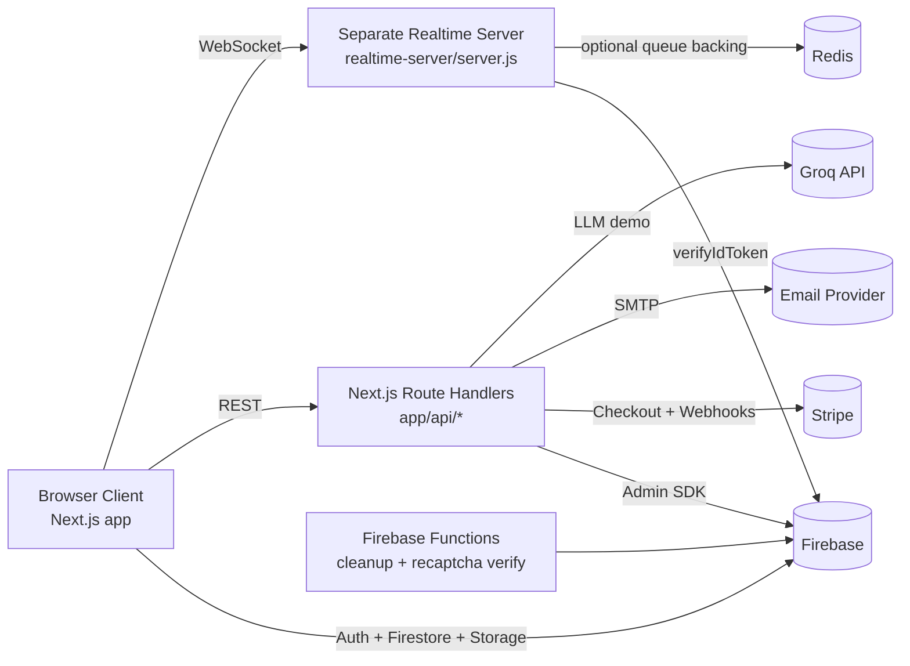

# tempted.chat

Modern random stranger chat platform built with Next.js + Firebase, with a separate WebSocket realtime server for low-latency stranger matching and signaling.

## What This App Does

- Auth: email/password, Google, and anonymous sign-in via Firebase Auth.
- Chat: random 1:1 text/video matching (plus group-ready support in realtime server).
- Security: end-to-end encrypted (E2EE) text and encrypted image payload support in room messages.
- AI demo: persona-based streaming text demo through Groq.
- Payments: Stripe checkout + webhook-driven subscription activation/revocation.
- Admin: user moderation, invite-based admin access, room/feedback/lost-found management.
- Utilities: password reset via email code, feedback form, lost-and-found board, demo video fallback.

## Architecture Overview



## Main Runtime Flow (End-to-End)

1. User signs in on `/`.
2. Client opens WebSocket to the realtime server and sends `auth` with Firebase ID token.
3. User selects mode/filters and sends `queue_join`.
4. Realtime server matches compatible users and emits `match_found`.
5. Client creates/merges room doc in Firestore (`rooms/{roomId}`), subscribes to room + messages, and starts presence heartbeats.
6. Peer connection signaling is relayed through realtime `signal` events (offer/answer/ice).
7. Chat messages are written to `rooms/{roomId}/messages`.
8. Text and image payloads are encrypted/decrypted in client using room-derived E2EE key material.
9. On leave/disconnect, server emits `peer_left`, clients close room, and cleanup paths remove stale room artifacts.

## Realtime Server (Separate Stranger Management)

The stranger matchmaking is handled by the standalone Node.js service in `realtime-server/`.

Responsibilities:

- WebSocket connection management.
- Firebase token verification (`auth` event).
- Queue management for `text`, `video`, and `group` modes.
- Compatibility matching by filters (gender/age/country/style).
- Fast signaling relay (`signal`) and peer notifications (`peer_left`, `chat`).
- Heartbeats, stale queue pruning, and room roster updates.
- Optional Redis persistence for queue state and multi-instance scaling.

Health endpoints:

- `GET /healthz` -> basic liveness.
- `GET /status` -> connected users, queue sizes, open group rooms.

## Data Model (Firestore + Storage)

Primary collections used:

- `users`: profile, auth provider, admin/blocked flags, moderation metadata.
- `rooms`: room state, participants, presence, participant profiles, E2EE public keys.
- `rooms/{roomId}/messages`: chat message stream (+ encrypted payload metadata).
- `rooms/{roomId}/webrtcCandidates`: fallback signaling candidates.
- `waitingUsers`: waiting/matchmaking state used by admin stats and cleanup paths.
- `subscriptions`: active tier, expiry, payment metadata.
- `adminInvites`: invite-token workflow for admin access.
- `passwordResetCodes`: one-time code flow for resetting password.
- `feedback`: user-submitted issues/feedback (+ optional image URLs).
- `lostFoundPosts`: reconnect board entries.
- `demoVideos`: fallback demo media catalog.

Storage paths:

- `chatUploads/{roomId}/{uid}/...`: chat image uploads.
- `feedback/{uid}/...`: feedback screenshots.

## API Surface (Next.js Route Handlers)

### Payments and Subscription

- `POST /api/checkout`
	- Auth required (Bearer token or `idToken` in body).
	- Creates Stripe Checkout Session from `planId`.
	- Embeds `uid`, `planId`, `tier`, `durationMs` in metadata.

- `GET /api/subscription`
	- Auth required.
	- Returns active status and current subscription metadata for caller.

- `POST /api/webhook`
	- Stripe signature verified using `STRIPE_WEBHOOK_SECRET`.
	- Handles:
		- `checkout.session.completed`: activate/extend subscription.
		- `charge.refunded`: revoke subscription.
		- `charge.dispute.closed` (lost): revoke subscription.
	- Sends invoice/refund emails when possible.

### AI Demo

- `POST /api/demo/text`
	- Streams model tokens from Groq.
	- Supports persona config and adult/non-adult system prompt modes.

- `GET /api/demo/fakeusers`
	- Returns list of local demo video assets from `public/demo/fakeusers`.

### Auth Utilities

- `POST /api/auth/reset-password`
	- Stores 6-digit reset code (15 min expiry), sends email.
	- Always returns success-like response to avoid account enumeration.

- `POST /api/auth/reset-password/confirm`
	- Validates code and updates Firebase Auth password.

### Admin APIs

- `POST /api/admin/invite`: create admin invite + send invite email.
- `GET /api/admin/invite`: list current admins + pending invites.
- `DELETE /api/admin/invite/[token]`: revoke pending invite.
- `POST /api/admin/accept-invite`: accept invite and grant admin role.
- `DELETE /api/admin/admins/[uid]`: remove another admin (must keep at least one admin).
- `PATCH /api/admin/users/[uid]`: block/unblock user.
- `POST /api/admin/users/[uid]`: issue warning to user (+ optional email).
- `DELETE /api/admin/users/[uid]`: delete non-admin user and related docs.
- `DELETE /api/admin/users/anonymous`: bulk delete anonymous users.

### Dev Utility

- `POST /api/test-email`
	- Disabled in production.
	- Requires `x-test-secret` header matching `TEST_EMAIL_SECRET`.

## Cloud Functions

`functions/index.js` includes:

- `cleanupOrphanRooms` (scheduled every 10 minutes)
	- Deletes ended rooms older than 10 minutes.
	- Deletes active rooms with stale presence (30 minutes).
	- Cleans matching `waitingUsers` docs and Storage artifacts.

- `verifyRecaptcha` (callable)
	- Verifies reCAPTCHA token against Google API.

## Environment Variables

Create `/.env.local` for Next.js and `/realtime-server/.env` for realtime server.

### Next.js app (`.env.local`)

- `NEXT_PUBLIC_FIREBASE_API_KEY`
- `NEXT_PUBLIC_FIREBASE_AUTH_DOMAIN`
- `NEXT_PUBLIC_FIREBASE_PROJECT_ID`
- `NEXT_PUBLIC_FIREBASE_STORAGE_BUCKET`
- `NEXT_PUBLIC_FIREBASE_MESSAGING_SENDER_ID`
- `NEXT_PUBLIC_FIREBASE_APP_ID`
- `NEXT_PUBLIC_FIREBASE_MEASUREMENT_ID`
- `FIREBASE_SERVICE_ACCOUNT_KEY` (JSON string for Admin SDK)
- `GOOGLE_APPLICATION_CREDENTIALS` / `GOOGLE_CLOUD_PROJECT` (optional Admin SDK alt)
- `NEXT_PUBLIC_APP_URL`
- `NEXT_PUBLIC_REALTIME_WS_URL` (ex: `ws://localhost:8787`)
- `NEXT_PUBLIC_DISABLE_REALTIME_WS` (`true` to disable)
- `NEXT_PUBLIC_RECAPTCHA_SITE_KEY`
- `NEXT_PUBLIC_TURN_HOST`
- `NEXT_PUBLIC_TURN_USERNAME`
- `NEXT_PUBLIC_TURN_CREDENTIAL`
- `STRIPE_SECRET_KEY`
- `STRIPE_WEBHOOK_SECRET`
- `GROQ_API`
- `SMTP_HOST`
- `SMTP_PORT`
- `SMTP_USER`
- `SMTP_PASS`
- `SMTP_FROM`
- `TEST_EMAIL_SECRET` (dev-only route)

### Realtime server (`realtime-server/.env`)

- `REALTIME_PORT` (default: `8787`)
- `REDIS_URL` (optional)
- `FIREBASE_PROJECT_ID` or `GCLOUD_PROJECT`
- `FIREBASE_SERVICE_ACCOUNT_KEY` (optional JSON string)

## Local Development

1. Install root dependencies.

```bash
npm install
```

2. Install realtime server dependencies.

```bash
cd realtime-server
npm install
cd ..
```

3. Start Next.js app.

```bash
npm run dev
```

4. Start realtime server (new terminal).

```bash
npm run realtime:dev
```

5. Open `http://localhost:3000`.

## Admin Access Setup

Admin role is read from Firestore `users/{uid}`.

Minimum fields:

```json
{
	"role": "admin",
	"isAdmin": true
}
```

## Build and Deploy Notes

- App build:

```bash
npm run build
npm run start
```

- Firebase Functions deploy:

```bash
cd functions
npm install
npm run deploy
```

- Realtime server deploy:
	- Deploy `realtime-server/server.js` as a long-running Node process (VM/container).
	- Set env vars listed above.
	- Point `NEXT_PUBLIC_REALTIME_WS_URL` to the deployed WS endpoint.

## Realtime Protocol Quick Reference

Client -> server events:

- `auth` `{ token }`
- `queue_join` `{ mode, filters, profile, nickname? }`
- `queue_ping`
- `queue_leave`
- `signal` `{ roomId, toUid, kind: "offer"|"answer"|"ice", payload }`
- `chat` `{ roomId, toUid, data }`
- `peer_left` `{ roomId, toUid }`
- `room_leave` `{ roomId }`

Server -> client events:

- `hello`
- `auth_ok`
- `queue_joined`
- `queue_waiting`
- `queue_left`
- `match_found`
- `signal`
- `peer_left`
- `group_member_left`
- `error`

## Operational Tips

- If no Redis is configured, realtime falls back to in-memory queueing.
- Keep clocks reasonably in sync across instances for TTL/heartbeat behavior.
- Stripe webhooks must reach `/api/webhook` with valid signature header.
- For production SMTP deliverability, configure SPF/DKIM for your sender domain.
- Remove or keep locked `POST /api/test-email` in production environments.

## Tech Stack

- Frontend: Next.js 16, React 19, TypeScript.
- Auth/DB/Storage: Firebase (Auth, Firestore, Storage).
- Realtime: Node.js + `ws`, optional Redis (`ioredis`).
- Payments: Stripe.
- AI demo: Groq (`llama-3.3-70b-versatile`).
- Motion/UI: Framer Motion + custom components.
